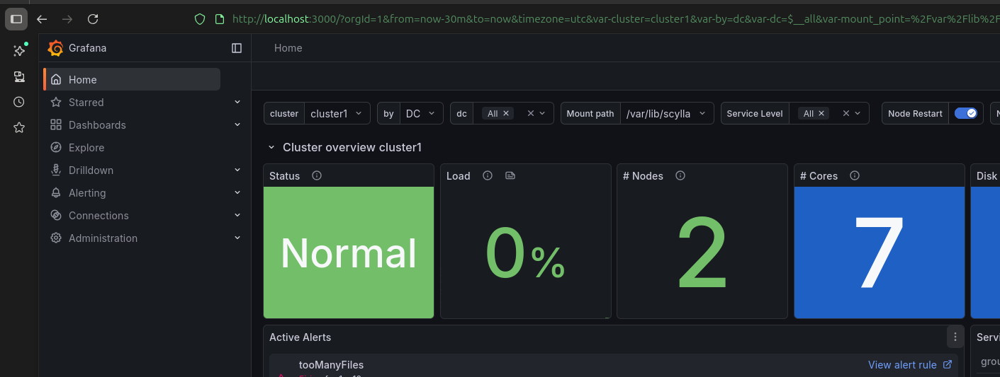

# How to run benchmarks with Scylla Monitoring Stack

1. Create `./prometheus/scylla_servers.yml`:

    - you can just copy the content of `./prometheus/scylla_servers.yml.example` and adjust it to your needs
    - make sure that labels are correct, you can check the proper values by runnign `scylla nodetool status` against each node

        ```yaml
        - targets:
            - scylla1:9180
        labels:
            cluster: cluster1
            dc: datacenter1
        - targets:
            - scylla2:9180
        labels:
            cluster: cluster1
            dc: datacenter1
        ```

2. Run:

    > ./make-compose.sh -v 2025.4
    > ./generate-dashboards.sh -F -v 2025.4

    This will generate necessary configuration files and start the stack. You can just kill it after it starts:

    > ./kill-all.sh

3. Prepare your `./docker-compose.yaml`:

    - expose ports if you want to access containers from outside of the stack (e.g. looking at grafana dashboard):

        ```yaml
        #ports:
        # - "port_on_the_machine:port_in_the_container"
        # - "3000:3000"
        ```

        - some of them are already configured and use variables, defined in `./.env` file, so you can just adjust the values there

        - make sure not to create a conflict with already used ports on your machine / other services in the stack
        - f.e.:

            ```yaml
            scylla1:
            ports:
            - "49180:9180" # cql port
            - "12345:10000" # rest api port, see /ui for swagger documentation

            grafana:
            ports:
            - "3000:3000" # grafana port

            prometheus:
            ports:
            - "9090:9090" # prometheus port
            ```

    - if you want to preserve metrics, look at grafana's volumes section:

        ```yaml
        #GRAFANA_VOLUMES
        # - path/to/grafana/dir:/var/lib/grafana
        ```

    - Examplary scylla config:

        ```yaml:
        scylla1:
            image: scylladb/scylla:2026.1.0-rc1
            ports:
            - "49181:9180"
            - "12346:10000"
            command: --smp 4 --memory 1G --api-address 0.0.0.0 --seeds scylla1 --reactor-backend=epoll
            restart: on-failure:2
            healthcheck:
            test: ["CMD-SHELL", "[ $$(nodetool statusgossip) = running ]"]
            interval: 10s
            timeout: 5s
            retries: 10
            start_period: 20s

        scylla2:
            image: scylladb/scylla:2026.1.0-rc1
            ports:
            - "49182:9180"
            - "12347:10000"
            command: --smp 4 --memory 1G --api-address 0.0.0.0 --seeds scylla1 --reactor-backend=epoll
            restart: on-failure:2
            healthcheck:
            test: ["CMD-SHELL", "[ $$(nodetool statusgossip) = running ]"]
            interval: 10s
            timeout: 5s
            retries: 10
            start_period: 20s
        ```

    - make sure the names of the ocntainers match the one defined in `./prometheus/scylla_servers.yml` and that the healthcheck is properly defined (you can check the proper command by running `scylla nodetool statusgossip` against each node)

4. Run `docker compose up` and wait until all services are healthy. You can check the status of each service by running `docker ps` and looking at the "STATUS" column. For scylla nodes, you should see "healthy" in the status.

5. Once all services are healthy, you can access Grafana at `http://localhost:3000` (or the port you specified in the `docker-compose.yaml`) and start creating dashboards to visualize your ScyllaDB metrics.

    

6. If everything is up smoothly, you can run your benchmarks against the scylla nodes and see the metrics in Grafana.

    ```yaml
    cassandra:
        image: scylladb/cassandra-stress:latest
        command: write n=1000000 -node scylla1, scylla2
        depends_on:
            scylla1:
                condition: service_healthy
            scylla2:
                condition: service_healthy
    ```

## Troubleshooting

1. Check for ports conflict.

2. See if all scylla targets for prometheus are up and running by accessing `http://localhost:9090/targets` (or the port you specified for prometheus) and looking for the "scylla_servers" target. If the target is down, check the logs of your scylla nodes to see if there are any issues with the health checks or if the nodes are not starting properly.

3. See logs for scylla and if they started correctly

4. Do not specify `--listen-address 0.0.0.0` for scylla